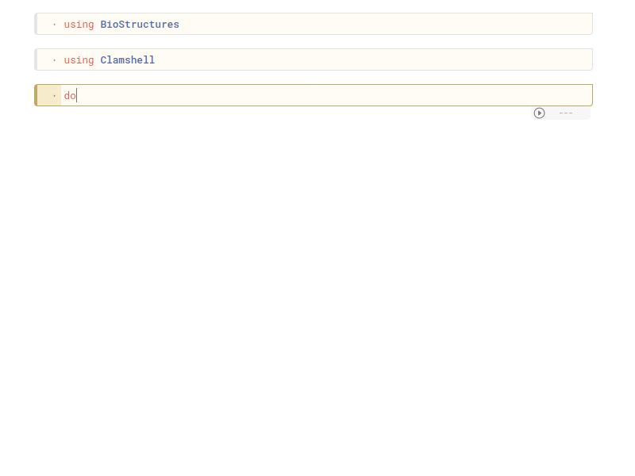

# Introduction

Clamshell is a computational structural biology library for performing calculations related to [ENM (elastic network models)](https://pre.csb.pitt.edu/Faculty/bahar/publications/07-Lezon-Networks%20book%20chapter.pdf). The main focus of the library is to utilize the dynamics data for machine learning purposes for different applications such as structure prediction, docking scoring etc. It also includes functions to visualize the network structure, correlations and vectors related to dynamics using [Pluto.jl notebooks.](https://github.com/fonsp/Pluto.jl) Below you can see an example on how to visualize the groups of residues which have correlating movements, using [Gaussian Network Model.](https://en.wikipedia.org/wiki/Gaussian_network_model)

